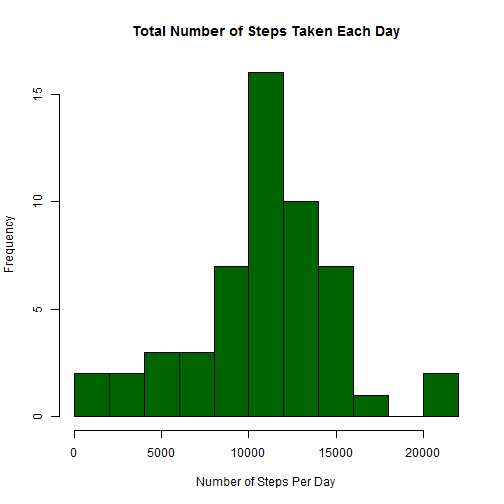
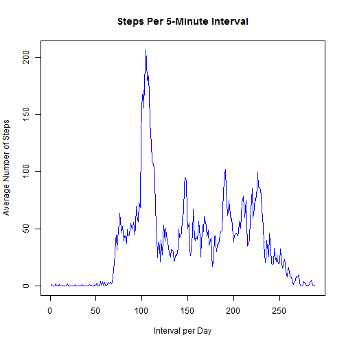
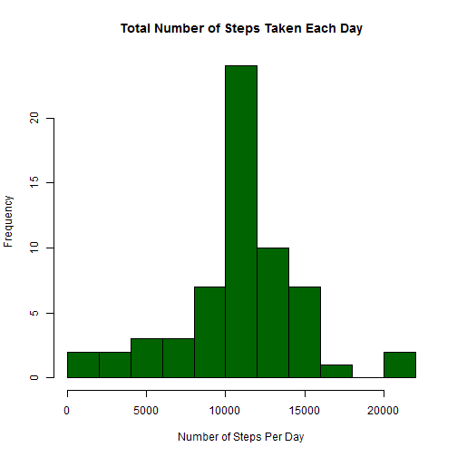
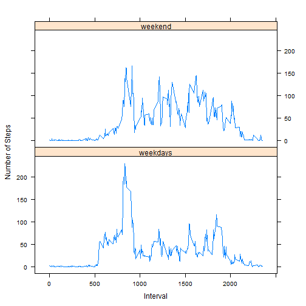

<!-- rmarkdown v1 -->
---
title: "PA1_template.Rmd"
author: "Andrew Marsh"
date: "May 3, 2016"
output: html_document
---


```r
knitr::opts_chunk$set(echo = TRUE)
```

## R Markdown
# Background - 
  It is now possible to collect a large amount of data about personal movement
  using activity monitoring devices such as a Fitbit, Nike Fuelband, or Jawbone Up. 
  These type of devices are part of the "quantified self" movement - a group of 
  enthusiasts who take measurements about themselves regularly to improve their health, 
  to find patterns in their behavior, or because they are tech geeks. 
  But these data remain under-utilized both because the raw data are hard to obtain 
  and there is a lack of statistical methods and software for processing and interpreting the data

## Load and Preprocess the data.

```r
        activityMonitor <- read.csv("activity.csv")
        activityMonitor$dateFmt <- as.Date(as.character(activityMonitor$date), "%Y-%m-%d")
        # Remove NA
        activityMonitorClean <- activityMonitor[ with (activityMonitor, { !(is.na(steps)) } ), ]
```

## What is mean total number of steps taken per day?
    Calculate the total number of steps taken per day
    Make a histogram of the total number of steps taken each day


```r
        stepsTotalPerDay <- tapply(activityMonitorClean$steps,activityMonitorClean$dateFmt, sum)
        hist(stepsTotalPerDay, breaks = 10, main = "Total Number of Steps Taken Each Day", 
             xlab = "Number of Steps Per Day", ylab = "Frequency", col = "darkgreen")
```


## Calculate and report the mean and median of the total number of steps taken per day


```r
        mean(stepsTotalPerDay)
```

```
## [1] 10766.19
```

```r
        median(stepsTotalPerDay)
```

```
## [1] 10765
```

## What is the average daily activity pattern?
      Make a time series plot (i.e. type = "l") of the 5-minute interval (x-axis) 
      and the average number of steps taken, averaged across all days (y-axis)


```r
        stepsMeanPerInterval <- tapply(activityMonitorClean$steps, activityMonitorClean$interval, mean)
        plot(stepsMeanPerInterval, type = "l", main = ("Steps Per 5-Minute Interval"), 
             xlab="Interval per Day", ylab = "Average Number of Steps",col="blue")
```



    Which 5-minute interval, on average across all the days in the dataset, 
    contains the maximum number of steps? -- 104


```r
    seq(along = stepsMeanPerInterval)[stepsMeanPerInterval == max(stepsMeanPerInterval)]
```

```
## [1] 104
```
## Imputing missing values - Note that there are a number of days/intervals where 
## there are missing values (coded as NA).
    Reload (eliminated NA prior)
    

```r
    activityMonitor <- read.csv("activity.csv")
    activityMonitor$dateFmt <- as.Date(as.character(activityMonitor$date), "%Y-%m-%d")
```
    Calculate and report the total number of missing values in the dataset
    (i.e. the total number of rows with NAs) -- 2304


```r
    sum(as.numeric(is.na(activityMonitor$steps)))
```

```
## [1] 2304
```
## Devise a strategy for filling in all of the missing values in the dataset
    The strategy does not need to be sophisticated. For example, you could use the mean/median
    for that day, or the mean for that 5-minute interval, etc.

```r
            stepsMeanPerInterval2 <- aggregate(data=activityMonitorClean, steps~interval, FUN=mean)
            mergeInterval <- merge(x=stepsMeanPerInterval2, y=activityMonitor, by="interval", 
                                   suffixes = c(".Old",".New"))
            # Create a new dataset that is equal to the original dataset but with the missing data filled in.
            mergeInterval$steps.New <- ifelse(is.na(mergeInterval$steps.New), 
                                          mergeInterval$steps.Old,mergeInterval$steps.New)        
            mergeInterval$steps.Old <-NULL
        
            # Make a histogram of the total number of steps taken each day and 
            stepsTotalPerDay2 <- tapply(mergeInterval$steps.New,mergeInterval$dateFmt, sum)
            hist(stepsTotalPerDay2, breaks = 10, main = "Total Number of Steps Taken Each Day", 
                xlab = "Number of Steps Per Day", ylab = "Frequency", col = "darkgreen")
```


## Calculate and report the mean and median total number of steps taken per day.

```r
            # Do these values differ from the estimates from the first part of the assignment? 
                # Not signigicantly
            # What is the impact of imputing missing data on the estimates of the total daily number of steps? 
                # More entries in the 10000 to 12000 per day
            mean(stepsTotalPerDay) # 10766.19
```

```
## [1] 10766.19
```

```r
            median(stepsTotalPerDay) # 10765
```

```
## [1] 10765
```

```r
            mean(stepsTotalPerDay2) # 10766.19
```

```
## [1] 10766.19
```

```r
            median(stepsTotalPerDay2) # 10766.19
```

```
## [1] 10766.19
```
## Are there differences in activity patterns between weekdays and weekends?


```r
            # For this part the weekdays() function may be of some help here. 
            # Use the dataset with the filled-in missing values for this part.
            # Create a new factor variable in the dataset with two levels - "weekday" 
                # and "weekend" indicating whether a given date is a weekday or weekend day.  
            mergeInterval$weekDays <- weekdays(mergeInterval$dateFmt)
            as.factor(mergeInterval$weeks[(mergeInterval$weekDays == "Saturday" | 
                                     mergeInterval$weekDays == "Sunday")] <- "weekend")
```

```
## [1] weekend
## Levels: weekend
```

```r
            mergeInterval$weeks[!(mergeInterval$weekDays == "Saturday" |
                                      mergeInterval$weekDays == "Sunday")] <- "weekdays"

            # Make a panel plot containing a time series plot (i.e. type = "l") of the 5-minute interval (x-axis) 
            # and the average number of steps taken, averaged across all weekday days or weekend days (y-axis).
            library(reshape)
            mergeInterval <- rename(mergeInterval, c(steps.New="steps"))
            
            library(plyr)
            weekDayEnd<- ddply(mergeInterval, .(weeks,interval), colwise(mean, .(steps))) 
            library(lattice)
            xyplot(steps ~ interval | weeks, data = weekDayEnd, type = "l", xlab = "Interval", 
                   ylab = "Number of Steps", layout = c(1, 2))  
```


